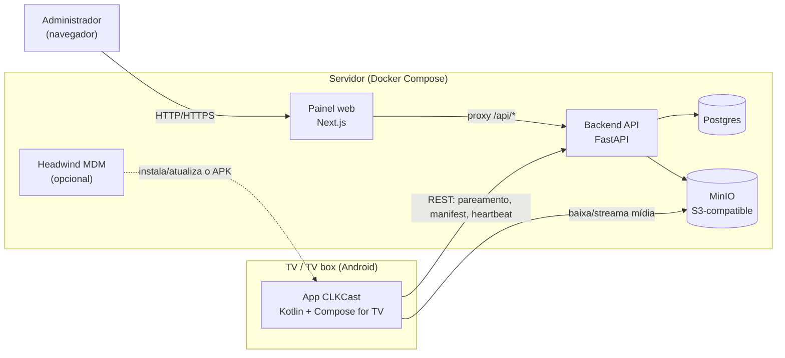

# Arquitetura — CLKCast

Retrato técnico atual dos componentes do sistema, como eles se conectam e
por que certas escolhas foram feitas. Pra decisões detalhadas e o
histórico completo de "por que assim", ver `PROJECT.md` na raiz — este
documento é o estado atual, não o diário de bordo do projeto.

- [Visão geral](#visão-geral)
- [Componentes](#componentes)
- [Fluxo de pareamento de um dispositivo](#fluxo-de-pareamento-de-um-dispositivo)
- [Playlist final de uma TV](#playlist-final-de-uma-tv)
- [Autenticação](#autenticação)
- [Configuração do app: runtime, não build-time](#configuração-do-app-runtime-não-build-time)
- [Distribuição do app nas TVs](#distribuição-do-app-nas-tvs)
- [Publicação das imagens Docker](#publicação-das-imagens-docker)

## Visão geral

O painel nunca fala com o backend a partir do navegador do admin — todo
`/api/*` é resolvido pelo próprio servidor Next.js via `rewrites()` (ver
`frontend/next.config.ts`), então o cookie de sessão setado pelo backend
atravessa transparente pro navegador, sem o frontend manusear o token.

## Componentes

| Componente | Tecnologia | Responsabilidade |
|---|---|---|
| App Android TV | Kotlin, Jetpack Compose for TV, Media3/ExoPlayer | Roda em cada TV; exibe a playlist, reporta heartbeat, baixa/streama mídia |
| Backend | FastAPI + SQLAlchemy + Alembic | Fonte única de verdade: dispositivos, grupos, conteúdo, atribuições, autenticação |
| Painel web | Next.js 16 (App Router) | Interface de administração; nunca fala direto com o backend, só via proxy `/api/*` |
| Postgres | Postgres 16 | Dados relacionais (dispositivos, grupos, conteúdo, atribuições) |
| MinIO | S3-compatible | Storage dos arquivos de mídia enviados pelo painel |
| Headwind MDM | Tomcat/Java (imagem oficial `headwindmdm/hmdm`) | Opcional — instala/atualiza o APK remotamente e aplica modo kiosk. Camada separada, sem integração além de estar no mesmo compose |

## Fluxo de pareamento de um dispositivo

1. O app chama `POST /devices/register` (sem `device_id` — primeira vez)
   e recebe `{id, pairing_code}`; salva o `id` localmente.
2. O app faz polling em `GET /devices/{id}/status` até `is_linked = true`,
   mostrando o `pairing_code` em tela cheia enquanto espera.
3. No painel, o admin vincula a TV — direto na lista (só dá um nome,
   `PUT /devices/{id}`) ou digitando o `pairing_code` (`POST
   /devices/link`, útil com várias TVs pendentes ao mesmo tempo).
4. A partir daí o app consulta `GET /devices/{id}/manifest` pra saber o
   que exibir e reporta `POST /devices/{id}/heartbeat` a cada 30s.

## Playlist final de uma TV

Conteúdo pode ser atribuído a um **dispositivo específico** ou a um
**grupo inteiro** (uma TV pode pertencer a vários grupos). A playlist
final devolvida por `GET /devices/{id}/manifest` é a mescla ordenada dos
dois — essa lógica vive inteira no backend; o app só reproduz a lista que
recebe, sem saber se um item veio do dispositivo ou de um grupo.

## Autenticação

Usuário único fixo via variável de ambiente (`ADMIN_USERNAME`/
`ADMIN_PASSWORD`) — sem tabela de usuários, JWT (`PyJWT`, HS256) em
cookie `httpOnly` setado pelo backend. Suficiente pro caso de uso atual
(um admin cuida do painel por instalação); ver `PROJECT.md` se isso
precisar mudar (múltiplos operadores, permissões diferentes).

## Configuração do app: runtime, não build-time

Diferente de um app interno típico, o endereço do backend **não é
fixado no APK**. Na primeira execução, sem servidor configurado, o app
mostra uma tela pra digitar o endereço, testa a conexão (`GET /health`)
e só então salva localmente (DataStore) e segue pro pareamento. Isso
existe justamente pra permitir distribuir **um único APK genérico**
(inclusive via Play Store, quando publicado) que funciona com qualquer
instalação do CLKCast, em vez de recompilar um APK por cliente/servidor.
`CLKCAST_API_BASE_URL` (`android/gradle.properties`) continua existindo
só como valor sugerido nessa tela, pra conveniência do fluxo de
desenvolvimento com emulador.

## Distribuição do app nas TVs

| Método | Quando usar |
|---|---|
| ADB manual | Poucas TVs; é o caminho pra TV box sem câmera (a maioria) |
| Headwind MDM | Várias TVs; dá instalação/atualização remota + modo kiosk |
| Play Store *(planejado, ainda não publicado)* | Instalação padrão (buscar e instalar), sem precisar de MDM nem ADB — só é viável porque o servidor é configurado em runtime (ver seção acima), não builda-se um APK por cliente |

## Publicação das imagens Docker

As imagens de `backend` e `frontend` são publicadas no Docker Hub
(`cloutrik/clkcast-backend`, `cloutrik/clkcast-frontend`) via GitHub
Actions (`.github/workflows/docker-publish.yml`), a cada push em `main`
e a cada tag `vX.Y.Z`. Isso permite instalar o CLKCast num servidor novo
**sem clonar o repositório nem buildar nada localmente** — ver
`docker-compose.prod.yml` e a seção correspondente em
[`docs/instalacao.md`](instalacao.md).
