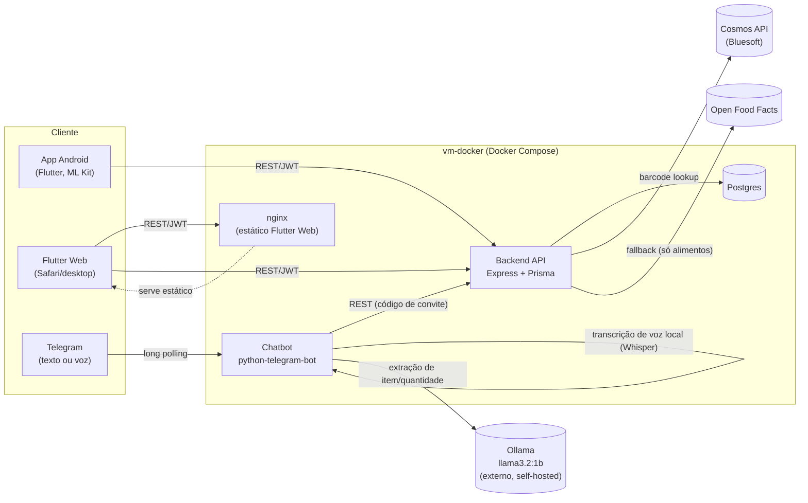

# Arquitetura — CLKCheckOrder

- [Visão geral](#visão-geral)
- [Componentes](#componentes)
- [Fluxo de uma compra no mercado](#fluxo-de-uma-compra-no-mercado)
- [Scanner: mobile vs. web](#scanner-mobile-vs-web)
- [Lookup de código de barras: Cosmos → Open Food Facts](#lookup-de-código-de-barras-cosmos--open-food-facts)
- [Itens em falta em casa (missing items)](#itens-em-falta-em-casa-missing-items)
- [Chatbot do Telegram](#chatbot-do-telegram)
- [Autenticação](#autenticação)
- [Roteamento em produção (Traefik)](#roteamento-em-produção-traefik)
- [Publicação das imagens Docker](#publicação-das-imagens-docker)

## Visão geral



## Componentes

| Componente | Tecnologia | Responsabilidade |
|---|---|---|
| App mobile | Flutter, `google_mlkit_barcode_scanning`, `google_mlkit_text_recognition` | Câmera nativa, decodificação de código de barras e OCR **on-device** (Android/iOS) |
| App web | Flutter Web, `mobile_scanner` (câmera do navegador) | Mesma UI/fluxo do mobile, mas sem ML Kit (indisponível na web) — código de barras via `BarcodeDetector` do navegador, OCR delegado ao backend |
| Backend | Node.js 20, Express 4, Prisma, PostgreSQL | Fonte única de verdade: usuários, lares, produtos, listas de compra, sessões de compra, itens em falta. Consumido pelo app e pelo bot |
| Chatbot | Python, `python-telegram-bot`, Whisper local, LangChain + Ollama | Interface por Telegram (texto/voz) pra ver/adicionar/remover itens em falta em casa |
| Postgres | Postgres 16 | Único banco relacional, compartilhado só pelo backend (nem o bot nem o app acessam direto) |

## Fluxo de uma compra no mercado

1. Usuário escaneia um produto (código de barras ou foto da etiqueta).
2. O app resolve nome/preço/nutrição (ver [lookup de código de barras](#lookup-de-código-de-barras-cosmos--open-food-facts) e [scanner](#scanner-mobile-vs-web)) e mostra um diálogo de confirmação editável antes de gravar qualquer coisa.
3. Ao confirmar, o item entra numa `PurchaseSession` (`POST /purchase-sessions/:id/items`) — o total da compra em andamento é a soma de `quantity * unitPrice` dos `PurchaseItem` da sessão.
4. O app cruza os itens escaneados com a `ShoppingList` do lar: mostra o que já foi pego, o que ainda falta, e sinaliza item extra (escaneado mas fora da lista) ou faltante (na lista mas não escaneado) — essa comparação é feita no cliente, a partir dos dois recursos (`shopping-list` e a sessão de compra atual), não é uma entidade própria no backend.
5. Ao finalizar (`POST /purchase-sessions/:id/finish`), a sessão vira `FINISHED` e a tela de resumo mostra o fechamento (total, itens a mais/a menos).

## Scanner: mobile vs. web

`google_mlkit_barcode_scanning`/`google_mlkit_text_recognition` só declaram
suporte a `android`/`ios` no `pubspec.yaml` deles — importar incondicionalmente
quebra `flutter build web`. A solução foi split por `export` condicional:

```dart
// mobile/lib/screens/scan_screen.dart
export 'scan_screen_mobile.dart' if (dart.library.html) 'scan_screen_web.dart';
```

- **Mobile** (`scan_screen_mobile.dart`): ML Kit faz tudo on-device — decodificação de barcode e OCR de texto, sem chamada de rede pro reconhecimento em si.
- **Web** (`scan_screen_web.dart`): `mobile_scanner` (usa o `BarcodeDetector` nativo do navegador, com fallback em `zxing-wasm`, funciona no Safari do iPhone) faz a detecção de código de barras ao vivo; pra OCR, tira uma foto (`image_picker`, câmera do navegador) e envia pro backend (`POST /products/ocr-extract`, Tesseract.js/WASM, pacote de idioma português) — o backend não tem ML Kit disponível em servidor, então o OCR real acontece lá via Tesseract em vez do ML Kit.
- As heurísticas de "qual linha é o nome do produto" e "qual linha é o preço" (regex pra formato brasileiro `R$ 12,90`) são funções puras compartilhadas em `mobile/lib/services/text_heuristics.dart`, usadas pelos dois caminhos em cima do texto reconhecido (venha do ML Kit ou do Tesseract).

## Lookup de código de barras: Cosmos → Open Food Facts

`GET /products/barcode/:code` (`backend/src/routes/products.ts`):

1. Cache local (`Product.barcode` já visto antes) — se achar, devolve direto.
2. **Cosmos API** (Bluesoft, `backend/src/lib/cosmos.ts`) — base brasileira de GTIN/código de barras com cobertura ampla de categorias (não só alimentos). Primária porque resolve o caso que motivou a troca: produtos de limpeza/higiene que o Open Food Facts (só alimentos) não tem. Silenciosamente retorna `null` se `COSMOS_API_TOKEN` não estiver configurado, sem quebrar o fluxo.
3. **Open Food Facts** — fallback, só alimentos, mas traz `nutritionalInfo` (a Cosmos não traz dados nutricionais).

Limitação conhecida: o plano gratuito da Cosmos é de 10 requisições/mês —
aceito deliberadamente por ora; ver [evolução do projeto](./evolucao.md).

## Itens em falta em casa (missing items)

`MissingItem` é por `Household`, não por usuário — qualquer membro do lar
(app ou bot do Telegram) vê e edita a mesma lista. Rotas autenticadas
(`backend/src/routes/missingItems.ts`, sessão de usuário via JWT) e rotas
"de bot" (`backend/src/routes/bot.ts`), que usam o **código de convite** do
lar como credencial em vez de login — o bot nunca autentica um usuário
individual, só resolve o lar pelo código a cada chamada.

## Chatbot do Telegram

Vínculo `chat_id → invite_code` guardado em SQLite local (`chatbot/src/link_store.py`);
`/entrar <código>` associa o chat a um lar (mesmo código de convite usado no app).

Mensagens de voz: baixadas como `.oga`, convertidas pra WAV 16kHz mono
(`ffmpeg`, `chatbot/src/audio_transcription.py`) e transcritas com
**Whisper local** ("small", CPU) — texto resultante segue pro mesmo
pipeline de intenção que uma mensagem de texto.

Entendimento de intenção (`chatbot/src/llm_agent.py`) é **híbrido**, não
100% LLM:

- **Classificar a ação** (`listar` / `adicionar` / `remover`) é feito por
  regras determinísticas em Python (regex/palavras-chave), não pelo LLM.
  Testes diretos contra o `llama3.2:1b` (1B parâmetros) mostraram que pedir
  pra ele decidir ação **e** extrair itens ao mesmo tempo era não-confiável
  (confundia ação com frequência, especialmente em frases compostas).
- O LLM (via `langchain_ollama.OllamaLLM`, `format="json"`) fica só com a
  tarefa mais estreita — e onde ele é bom — que é **extrair produto(s) e
  quantidade(s)** de uma frase já classificada como `adicionar`/`remover`.
  Isso também deixa `listar`/`desconhecido` instantâneos (nenhuma chamada ao
  LLM é feita nesses casos).
- Suporta múltiplos itens numa frase só ("está faltando 4 litros de óleo e
  um saco de arroz de 5kg" → dois itens), via poucos exemplos few-shot no
  prompt (sem schema abstrato genérico, que o modelo pequeno tende a copiar
  literalmente em vez de preencher).

Ollama e o modelo (`llama3.2:1b`) são os mesmos já usados pelo projeto
irmão `ByteGasto` (self-hosted, `192.168.18.31:11434`) — reaproveitado por
decisão explícita, não uma segunda instância.

## Autenticação

JWT emitido pelo backend (`backend/src/lib/auth.ts`) — login por
e-mail/senha (`bcryptjs`) ou Google Sign-In (`backend/src/lib/googleAuth.ts`,
`google-auth-library`, valida o ID token do Google e casa/cria o `User` por
`googleId`). Rotas do bot (`/bot/*`) são a única exceção — não exigem JWT,
usam o código de convite do lar como credencial (ver
[itens em falta](#itens-em-falta-em-casa-missing-items)).

## Roteamento em produção (Traefik)

Um único domínio (`smitten-vitamins-securely.ngrok-free.dev`, túnel ngrok
pro gateway Traefik compartilhado — ver `HomeLabDevelopment`) serve tanto a
API quanto o frontend web, por prefixo de path:

- `/checkorder/api/*` → serviço `backend` (prioridade **60**, `stripprefix`
  remove `/checkorder/api` antes de chegar no Express).
- `/checkorder/*` (qualquer coisa que não bateu com `/api` acima) → serviço
  `web` (nginx servindo o build estático do Flutter Web; prioridade **50**).

A prioridade maior da rota `/api` é obrigatória: Traefik escolhe pela regra
mais específica só se as prioridades estiverem certas — sem isso, a rota
genérica do `web` (que também combina com `/checkorder/api/...` como
prefixo) venceria a da API.

O app mobile aponta pra `https://.../checkorder/api` (`api_client.dart`) —
qualquer troca desse prefixo exige reinstalar o APK no tablet, já que a
URL do backend está embutida no binário, não é configurável em runtime.

## Publicação das imagens Docker

Três imagens, publicadas no Docker Hub via GitHub Actions
(`.github/workflows/docker-publish.yml`) a cada push em `main` ou tag `v*`:
`cloutrik/clkcheckorder-backend`, `cloutrik/clkcheckorder-chatbot`,
`cloutrik/clkcheckorder-web`. A imagem `web` precisa do build estático do
Flutter Web (`flutter build web --base-href /checkorder/`) rodado **antes**
do `docker build`, já que `web/Dockerfile` só copia um `dist/` já pronto —
por isso esse job do workflow roda o Flutter primeiro, diferente dos outros
dois (que buildam Docker puro a partir do próprio Dockerfile).
