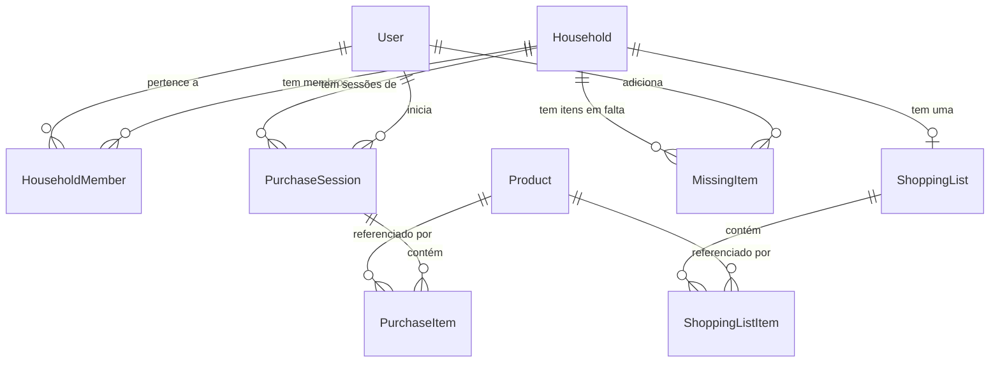

# Banco de dados

Postgres 16, schema único (`backend/prisma/schema.prisma`), migrações via
Prisma Migrate (`backend/prisma/migrations/`). Sem multi-tenancy por
schema/database — o isolamento entre lares é feito por `householdId` nas
próprias tabelas, não por instância separada.

## Entidades

### User
Conta de uma pessoa. `passwordHash` é opcional — nulo para quem entrou só
via Google (`googleId` preenchido); `email` é sempre único e serve de
identidade em ambos os fluxos de login.

### Household ("lar")
Unidade de compartilhamento — família ou grupo de moradores. `inviteCode`
é a credencial usada tanto pra um segundo usuário entrar pelo app
(`POST /households/join`) quanto pelo chatbot do Telegram vincular um chat
(`/entrar <código>`), sem precisar de login próprio no bot.

### HouseholdMember
Tabela de junção `User` × `Household`, com `role` (`OWNER`/`MEMBER`) e
`@@unique([userId, householdId])` — um usuário não entra duas vezes no
mesmo lar. Quem cria o lar (`POST /households`) vira `OWNER`.

### Product
Catálogo compartilhado entre **todos** os lares (não é por household) —
uma vez resolvido um código de barras, o produto fica disponível pra
qualquer usuário que escanear o mesmo código depois, evitando nova consulta
à Cosmos/Open Food Facts. `priceSource` registra a origem do último preço
conhecido (`barcode` | `ocr` | `manual`); `nutritionalInfo` é `Json` livre
(formato vem direto do Open Food Facts, sem normalização própria).

### ShoppingList / ShoppingListItem
`ShoppingList` é **1:1 com `Household`** (`@unique` em `householdId`) — um
lar tem exatamente uma lista de compras ativa, não um histórico de listas.
`ShoppingListItem.productId` é opcional: `freeText` cobre o caso de item
adicionado à mão, ainda sem produto casado (ex: "detergente de louça"
antes de qualquer scan confirmar qual `Product` é esse).

### PurchaseSession / PurchaseItem
Uma `PurchaseSession` é uma ida ao mercado — criada ao começar a escanear
(`POST /purchase-sessions`), `status` vai de `IN_PROGRESS` a `FINISHED`
(`POST /purchase-sessions/:id/finish`, seta `finishedAt`). Cada
`PurchaseItem` é um produto confirmado durante essa sessão, com o
`unitPrice` e `priceSource` daquele momento — **não** o preço atual do
`Product` (histórico de preço por compra, não só o último conhecido).

### MissingItem
"Itens em falta em casa" — por `Household`, não por usuário; qualquer
membro (app ou bot) vê e edita a mesma lista. `addedById` sempre aponta pra
um `User` real; quando o item é adicionado via bot do Telegram, é usado um
usuário de sistema (`bot@clkcheckorder.local`, criado sob demanda) já que o
bot não autentica um usuário individual — só o lar, pelo código de convite.

## Decisões de schema que valem registrar

- **Sem tabela própria pra "resultado da comparação lista × sessão de
  compra"**: item a mais/a menos na finalização da compra é calculado no
  cliente, cruzando `ShoppingList`/`ShoppingListItem` com os `PurchaseItem`
  da sessão — não existe uma entidade persistida pra isso.
- **`Product` é global, não por household**: intencional, pra reaproveitar
  o resultado de um lookup de código de barras entre lares diferentes (a
  Cosmos tem cota mensal de 10 requisições no plano gratuito — ver
  [evolução do projeto](./evolucao.md) — cachear agressivamente importa).
- **`HouseholdRole` só tem `OWNER`/`MEMBER`**: sem permissões diferenciadas
  entre eles hoje (ambos podem editar lista, escanear, gerenciar itens em
  falta) — o papel existe pra uso futuro, não impõe restrição nenhuma nas
  rotas atuais.
